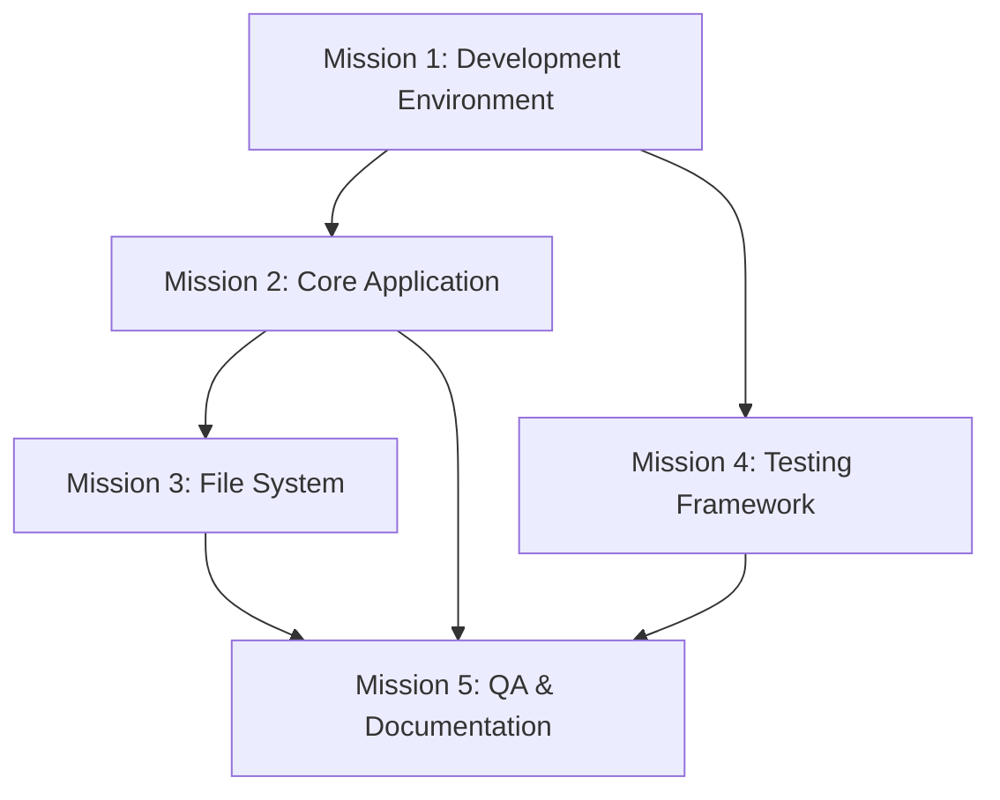

# Audobon MVP - Phase 1 Mission Structure

## Phase Duration: 2-3 Months

## Mission 1: Development Environment Foundation
**Duration**: 2 weeks

### Mission Objective
Establish a robust development environment that supports efficient application development and testing.

### Milestones
1. Development Tools Setup
   - VS Code configuration with required extensions
   - Node.js and npm setup
   - Git repository initialization
   - Docker environment configuration
   - Development environment documentation

2. Project Structure Implementation
   - Core directory structure
   - Initial dependency setup
   - Configuration files setup
   - Version control guidelines
   - Documentation templates
   - Build process configuration

### Deliverables
- [ ] Configured development environment
- [ ] Project repository with initial structure
- [ ] Development tools documentation
- [ ] Git workflow documentation
- [ ] Code style guide implementation

### Checkpoints
- ✓ All development tools installed and configured
- ✓ Project structure matches documentation
- ✓ Git hooks functioning correctly
- ✓ Build process successful
- ✓ Documentation templates in place

## Mission 2: Core Application Framework
**Duration**: 3 weeks

### Mission Objective
Implement the foundational application framework with Electron and React integration, ensuring robust IPC communication and resource monitoring.

### Technical Requirements
- IPC Bridge Implementation
  - Message protocol definition
  - Channel management
  - Error handling procedures
  - Bidirectional communication
  - Type-safe message passing

- Resource Monitoring
  - CPU usage tracking
  - Memory utilization monitoring
  - Performance metrics collection
  - Resource allocation tracking
  - Automated alerting system

### Milestones
1. Electron Setup
   - Main process configuration
   - IPC communication system
   - Window management
   - Development mode configuration

2. React Integration
   - React application structure
   - TypeScript configuration
   - Redux Toolkit setup
   - Basic routing system

3. UI Foundation
   - shadcn/ui integration
   - Tailwind CSS setup
   - Theme system implementation
   - Basic component library

### Deliverables
- [ ] Working Electron application shell
- [ ] React application with TypeScript
- [ ] Basic UI component library
- [ ] State management system
- [ ] IPC communication protocols
- [ ] Theme system documentation

### Checkpoints
- ✓ Electron builds successfully
- ✓ React components render correctly
- ✓ TypeScript compilation successful
- ✓ State management functional
- ✓ UI components meet design standards
- ✓ Hot reload functioning

## Mission 3: File System Integration
**Duration**: 2 weeks

### Mission Objective
Implement robust file system operations and local storage management.

### Milestones
1. File Operations
   - Basic file operations (read/write)
   - Project file structure
   - Asset management system
   - File watching system

2. Storage Management
   - Local storage implementation
   - Cache system setup
   - Backup functionality
   - Error handling

### Deliverables
- [ ] File system utility library
- [ ] Storage management system
- [ ] Cache implementation
- [ ] Backup system
- [ ] Error handling documentation
- [ ] File operation tests

### Checkpoints
- ✓ File operations working correctly
- ✓ Storage system performs efficiently
- ✓ Cache system functioning
- ✓ Backup system verified
- ✓ Error handling tested

## Mission 4: Testing Framework Implementation
**Duration**: 2 weeks

### Mission Objective
Establish comprehensive testing infrastructure for ensuring code quality and reliability.

### Milestones
1. Unit Testing Setup
   - Jest configuration
   - React Testing Library setup
   - Mock system implementation
   - Coverage reporting
   - Unit test guidelines

2. Integration Testing
   - Playwright configuration
   - E2E test scenarios
   - Test case documentation
   - CI pipeline setup
   - Testing environment setup
   - Performance test framework

### Deliverables
- [ ] Complete test suite setup
- [ ] CI/CD pipeline configuration
- [ ] Test documentation
- [ ] Coverage reports
- [ ] Testing guidelines

### Checkpoints
- ✓ Unit tests running successfully
- ✓ Integration tests passing
- ✓ Coverage meets requirements
- ✓ CI pipeline functioning
- ✓ Documentation complete

## Mission 5: Quality Assurance and Documentation
**Duration**: 2 weeks

### Mission Objective
Implement quality assurance tools and comprehensive documentation.

### Milestones
1. Code Quality Tools
   - ESLint configuration
   - Prettier setup
   - SonarQube integration
   - Performance monitoring

2. Documentation System
   - API documentation
   - Component documentation
   - Development guides
   - User guides

### Deliverables
- [ ] Code quality tool configuration
- [ ] Comprehensive documentation
- [ ] Style guide enforcement
- [ ] Performance benchmarks
- [ ] Quality metrics dashboard

### Checkpoints
- ✓ Linting tools functioning
- ✓ Documentation system complete
- ✓ Code quality metrics established
- ✓ Performance baselines set
- ✓ All critical documentation in place

### Performance Benchmarks
- Application startup time < 3 seconds
- UI interaction response < 100ms
- File operations response < 200ms
- Memory usage < 500MB at idle
- CPU usage < 10% at idle

### Cache System Requirements
- Implementation Strategy
  - Two-level cache architecture
  - Memory-based primary cache
  - Disk-based secondary cache
  - LRU eviction policy
  - Cache invalidation triggers

- Monitoring & Metrics
  - Cache hit/miss ratios
  - Storage usage tracking
  - Eviction rate monitoring
  - Performance impact metrics
  - Health check systems

### Quality Metrics Tracking
- Automated Metrics Collection
  - Code quality scores (daily)
  - Test coverage (per commit)
  - Build success rates (per build)
  - Performance metrics (hourly)
  - Error rates (real-time)

- Quality Dashboards
  - Real-time metrics display
  - Trend analysis
  - Alert thresholds
  - Historical data
  - Performance correlations

### Mission Dependencies

### Risk Assessment Checkpoints
- [ ] Development environment stability verified
- [ ] Core application performance validated
- [ ] File system operations tested under load
- [ ] Testing framework reliability confirmed
- [ ] Quality metrics achieving targets

### Phase 1 Completion Criteria

### Technical Requirements
- All missions completed successfully
- No critical bugs or issues
- Test coverage meets requirements (>80% for critical components)
- Performance metrics within targets
- Documentation complete and accurate
- All checkpoints validated
- Build process fully automated
- Security baseline established
- Code quality metrics achieved
- Integration tests passing

### Quality Metrics
- Code quality score > 85%
- Test coverage > 80%
- Build success rate > 95%
- Zero critical security issues
- Documentation coverage > 90%

### Transition to Phase 2 Requirements
- All missions completed
- No blocking issues
- Documentation updated
- Performance baselines established
- Testing framework verified
- Quality metrics met

### Phase 1 Sign-off Checklist
- [ ] All mission deliverables completed
- [ ] Checkpoints verified
- [ ] Quality metrics achieved
- [ ] Documentation approved
- [ ] Risk assessment completed
- [ ] Phase 2 preparation confirmed
